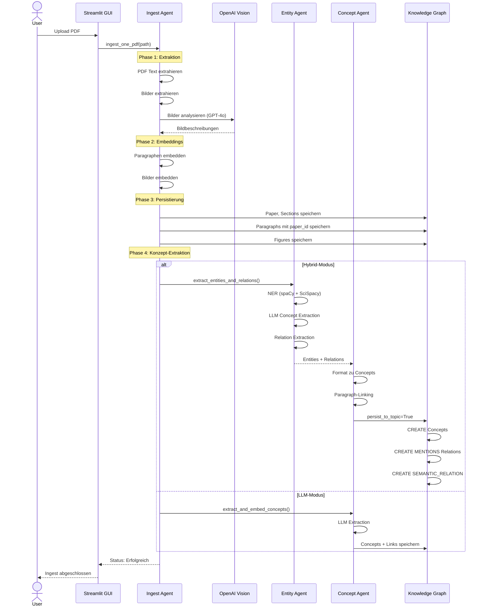
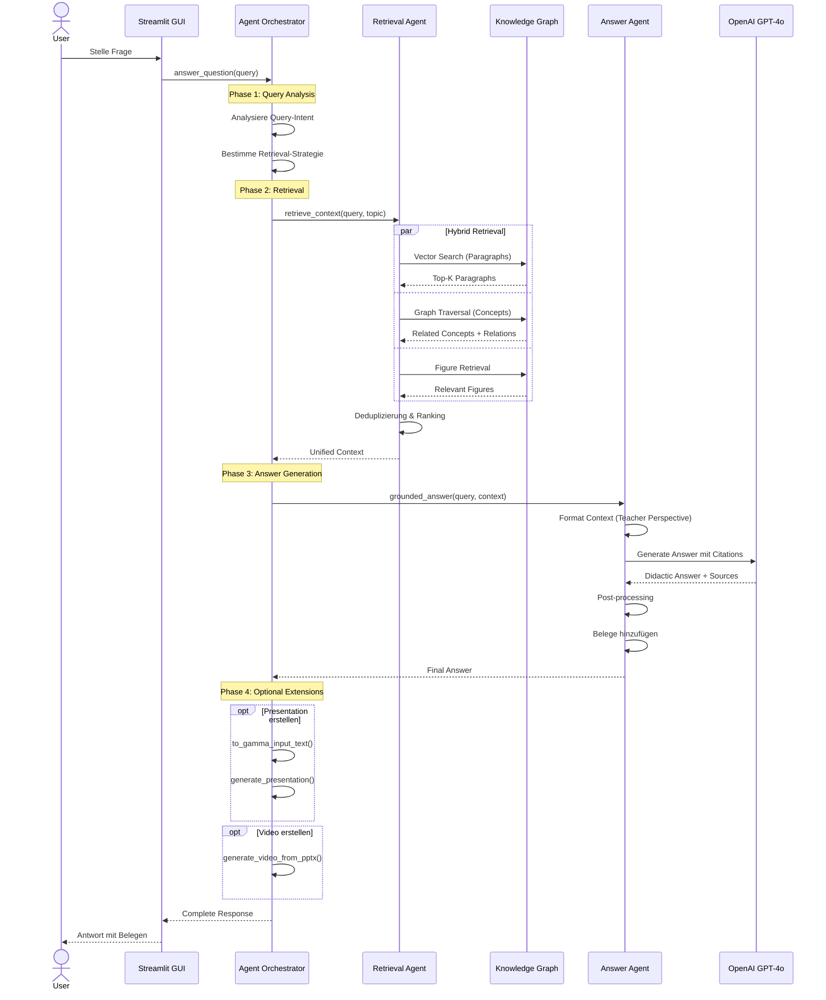
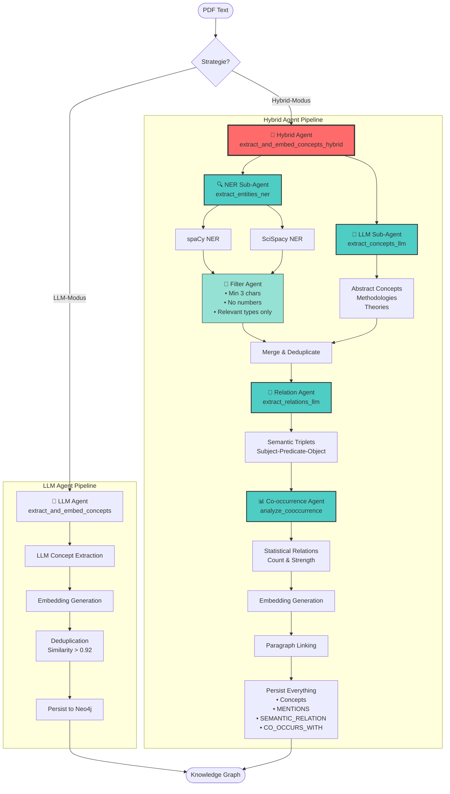
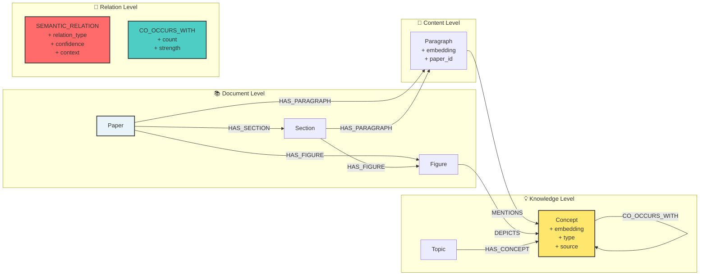
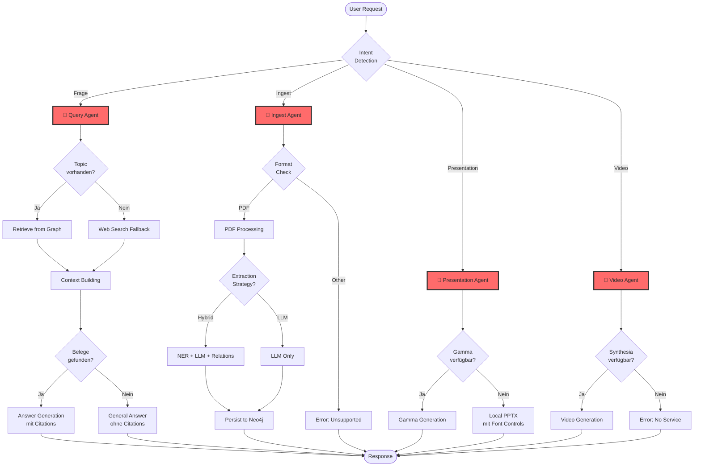
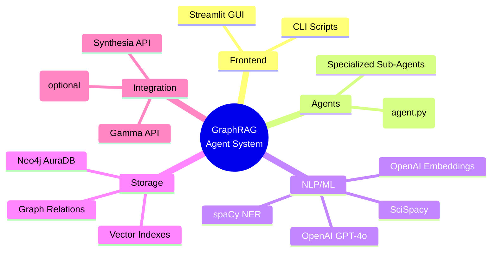

# System-Architektur: GraphRAG Agentensystem

## Übersicht

Dieses System implementiert ein **Multi-Agenten-System** für Retrieval-Augmented Generation (RAG) mit Knowledge Graph-Integration. Die Agenten arbeiten orchestriert zusammen, um wissenschaftliche Dokumente zu analysieren, Wissen zu extrahieren und Fragen didaktisch zu beantworten.

---

## Hauptkomponenten-Diagramm

```mermaid
graph TB
    subgraph "🎯 User Interface Layer"
        GUI[Streamlit GUI<br/>gui_app.py]
        CLI[CLI Scripts<br/>ask.py, ingest.py]
    end

    subgraph "🤖 Agent Orchestration Layer"
        AGENT[Agent Orchestrator<br/>agent.py<br/>• Query Routing<br/>• Tool Selection<br/>• Response Synthesis]
        
        subgraph "Spezialisierte Sub-Agenten"
            INGEST[📄 Ingest Agent<br/>pdf_ingest.py<br/>• PDF Parsing<br/>• Text Extraction<br/>• Image Analysis]
            
            CONCEPT[🧠 Concept Extraction Agent<br/>concept_extract.py<br/>• LLM-basiert<br/>• Hybrid (NER+LLM)<br/>• Semantic Relations]
            
            ENTITY[🔍 Entity & Relation Agent<br/>entity_relation_extract.py<br/>• Named Entity Recognition<br/>• Triplet Extraction<br/>• Co-occurrence Analysis]
            
            RETRIEVAL[🔎 Retrieval Agent<br/>retriever.py<br/>• Vector Search<br/>• Graph Traversal<br/>• Hybrid Retrieval]
            
            ANSWER[💬 Answer Agent<br/>openai_client.py<br/>• Grounded Answers<br/>• Didactic Explanations<br/>• Citation Generation]
        end
    end

    subgraph "🗄️ Knowledge Storage Layer"
        NEO[Neo4j Graph DB<br/>neo.py<br/>• Papers, Paragraphs<br/>• Concepts, Relations<br/>• Vector Indexes]
        
        VECTOR[Vector Embeddings<br/>OpenAI ada-002<br/>• Text Embeddings<br/>• Semantic Search]
    end

    subgraph "🔧 External Services"
        OPENAI[OpenAI API<br/>• GPT-4o<br/>• Embeddings<br/>• Vision]
        
        GAMMA[Gamma API<br/>gamma_client.py<br/>• Presentation Gen]
        
        SYNTH[Synthesia API<br/>synthesia_client.py<br/>• Video Gen]
    end

    %% Connections
    GUI --> AGENT
    CLI --> AGENT
    
    AGENT --> INGEST
    AGENT --> CONCEPT
    AGENT --> RETRIEVAL
    AGENT --> ANSWER
    
    INGEST --> NEO
    INGEST --> OPENAI
    
    CONCEPT --> ENTITY
    CONCEPT --> NEO
    CONCEPT --> OPENAI
    
    ENTITY --> OPENAI
    ENTITY --> NEO
    
    RETRIEVAL --> NEO
    RETRIEVAL --> VECTOR
    
    ANSWER --> OPENAI
    ANSWER --> RETRIEVAL
    
    NEO --> VECTOR
    
    AGENT --> GAMMA
    AGENT --> SYNTH

    style AGENT fill:#ff6b6b,stroke:#333,stroke-width:3px,color:#fff
    style INGEST fill:#4ecdc4,stroke:#333,stroke-width:2px
    style CONCEPT fill:#4ecdc4,stroke:#333,stroke-width:2px
    style ENTITY fill:#4ecdc4,stroke:#333,stroke-width:2px
    style RETRIEVAL fill:#4ecdc4,stroke:#333,stroke-width:2px
    style ANSWER fill:#4ecdc4,stroke:#333,stroke-width:2px
```

---

## Detaillierter Ablauf: PDF Ingest



---

## Detaillierter Ablauf: Query Processing



---

## Konzept-Extraktion: Hybrid-Agent Architektur



---

## Datenfluss im Knowledge Graph



---

## Agent-Entscheidungsbaum



---

## Key Features des Agentensystems

### 🎯 Orchestrierung (agent.py)
- **Zentrale Koordination**: Verwaltet alle Sub-Agenten
- **Context-Aware Routing**: Leitet Anfragen basierend auf Intent
- **Tool Selection**: Wählt die richtigen Tools/Agenten für die Aufgabe

### 🤖 Spezialisierte Agenten

1. **Ingest Agent** (pdf_ingest.py)
   - Verantwortlich für: PDF-Parsing, Text-/Bildextraktion
   - Nutzt: PyMuPDF, OpenAI Vision

2. **Concept Extraction Agent** (concept_extract.py)
   - Verantwortlich für: Konzept-Identifikation, Embedding
   - Modi: LLM-only oder Hybrid (delegiert an Entity Agent)

3. **Entity & Relation Agent** (entity_relation_extract.py)
   - Verantwortlich für: NER, Triplet-Extraktion, Co-occurrence
   - Nutzt: spaCy, SciSpacy, OpenAI GPT-4o
   - Filter: Qualitätskontrolle für wissenschaftliche Konzepte

4. **Retrieval Agent** (retriever.py)
   - Verantwortlich für: Hybrid Retrieval (Vector + Graph)
   - Strategien: Similarity Search, Graph Traversal, Figure Retrieval

5. **Answer Agent** (openai_client.py)
   - Verantwortlich für: Didaktische Antwortgenerierung
   - Perspektive: "Erfahrener Dozent und Lehrer"
   - Output: Strukturierte Erklärungen mit Belegen

### 🧠 Intelligente Features

- **Adaptive Retrieval**: Wählt beste Strategie basierend auf Query
- **Multi-Modal**: Text + Bilder + Relationen
- **Quality Control**: Filter für wissenschaftliche Relevanz
- **Didactic Synthesis**: Lern-orientierte Antworten
- **Citation Generation**: Automatische Quellenangaben

---

## Technologie-Stack



---

## Deployment & Ausführung

### Lokale Entwicklung
```bash
# Starte GUI (alle Agenten verfügbar)
streamlit run scripts/gui_app.py

# Direkter Agent-Aufruf (CLI)
python scripts/ask.py "Deine Frage"
python scripts/ingest.py pfad/zur/datei.pdf
```

### Agent-Konfiguration
- **Topic**: Bestimmt Knowledge Domain
- **Strategy**: LLM vs. Hybrid Extraction
- **Retrieval**: Vector + Graph Hybrid
- **Teacher Mode**: Didaktische Perspektive

---

## Zusammenfassung

Dieses System implementiert ein **hierarchisches Multi-Agenten-System**:

1. **Orchestrator-Agent** koordiniert alle Operationen
2. **Spezialisierte Sub-Agenten** führen spezifische Aufgaben aus
3. **Knowledge Graph** als zentraler Wissensspeicher
4. **Hybrid Retrieval** kombiniert Vector + Graph Search
5. **Didactic Answer Generation** mit Teacher Perspective

Die Agenten arbeiten **autonom** in ihren Domänen, werden aber **orchestriert** vom Hauptagenten für komplexe Workflows.
